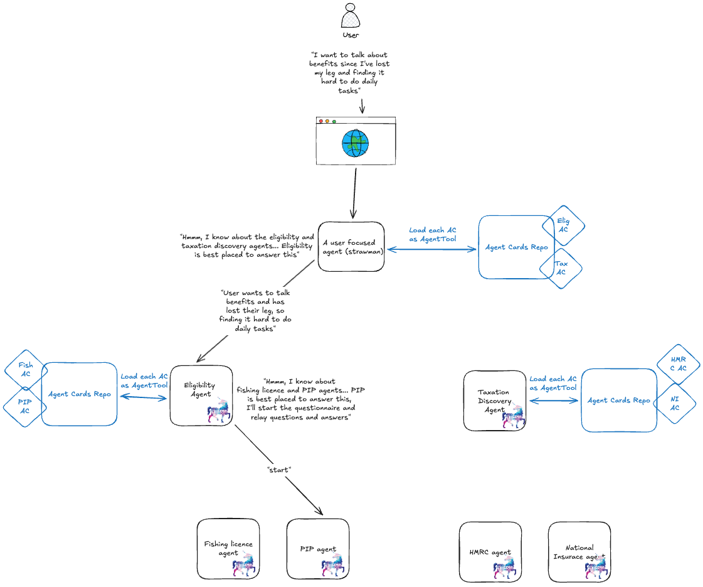

# A2A Discovery Proof-of-Concept

## What are you?

I'm a working proof-of-concept that demonstrates how to construct a highly decoupled, highly resilient
multi-agent architecture, and its technical viability. Here's a picture of the
architecture:

## How do I run you?

### ADK Setup

All agents in this repository were built with Google's 
[Agent Development Kit](https://google.github.io/adk-docs/). This means that you'll need
to install ADK on your machine to run me. Click 
[here](https://google.github.io/adk-docs/get-started/) to get started!

**PLEASE NOTE**: you do not have to get and set a `GOOGLE_API_KEY` environment variable!
Agents in this repository use Claude via Amazon Bedrock, rather than Google language 
models, and all infrastructure is set-up using locally available technology.

### AWS Profile Setup

You'll need to have set-up an AWS profile on your machine that can be used by 
[aws-vault](https://github.com/ByteNess/aws-vault). This AWS profile must have access to 
the `bedrock/eu.anthropic.claude-sonnet-4-5-20250929-v1:0` language model via 
[Amazon Bedrock](https://aws.amazon.com/bedrock/), since this is the language model used 
to power the agents within this proof-of-concept

### Starting me up!

Once you have an appropriate AWS profile set-up, open a terminal in my (this `README`'s) 
directory, and execute:

`$ ./run.sh`

If this doesn't work, you many need to run the following prior:

`$ chmod +x run.sh`

Once you've done that, go to http://localhost:8000 and have a chat with my agents!

## What's next for you?

- Add more agents to further prove out technical viability
- Store agent cards in a non-relational database
    - Enable agents to read agent cards from database
    - Enable ability to update agent cards at run-time
- Enable this to run on AWS cloud infrastructure