# Background

- GDS have an ambition to leverage Agentic technology to help UK residents understand what they are eligible for from government
    - Whilst a lot of departments are working on similar initiatives, GDS is looking to work with these initiatives to provide additional centralised channels applicable for all departments
- Eligibility rules can be complex, vague and/or incomplete
- Agentic innovations present an opportunity to offer bespoke, person-centric advice which abstracts away the cognitive load of understanding how their personal situation fits into a complex ecosystem

# Technical Challenges

<!-- clarify this -->
- Model hallucination when presented with a context not covered by instructions
- Epistemic Limits; can an agent answer "I don't know"?
  <!-- tighten up wording -->
- Assuring output space consistently meets accuracy and content standards when input space effectively unbounded

# Domain Challenges

- Importance of giving accurate advice in this context
    - We control for this partly by qualifying the answers given as informed advice rather than a definite outcome
- We are not subject-matter experts on any particular benefit, left to figure out what good looks like in naive way
    - We relied entirely on the eligibility guidance published on gov.uk to determine what the eligibility rules for a particular benefit were
- We don't have a sufficiently large/stratified cohort of users to be able to draw any empirically sound conclusions
    - We therefore had to lean on automated testing approaches alone
- A known issue surfaced through user research with advisors is that there are often so many edge case circumstances, that in total a non-trivial fraction of the population falls into one or more edge cases

# Questions we sought to answer

1. How well is an agent able to apply a set of eligibility rules when conversing with a user whose situation is covered by those rules?
2. To what extent is an agent able to report `INDETERMINATE` when presented with a situation not explicitly covered by eligibility rules?
<!-- 3. What are the most appropriate metrics to judge performance in this space? -->
<!-- TODO go back to initial wording -->
3. Given these metrics, what representation of eligibility rules results in the best performance (i.e. accuracy, consistency, token use, latency)?
4. How do we best simulate a user conversation in an authentic way that controls for systematic errors relating to its artificial nature?

# How we went about answering them: Question 1

> How well is an agent able to apply a set of eligibility rules when conversing with a user whose situation is covered by those rules?

- By examining the factors included in a particular set of eligibility rules (Child Benefit, taken from gov.uk), we synthesized a set of 100 scenarios by expressing these factors combinatorially for a family unit.
    - These gave us a known ground-truth outcome, on a per-child basis which was whether each child in the family unit was eligible for child benefit.
    - This outcome was, for each child in a family, whether they are eligible or ineligible for child benefit
- A test harness was constructed by modifying the event loop of Google ADK to facilitate top-level agent-to-agent dialogue
    - For each scenario, a prompt with all relevant scenario content was presented to another agent (the `actor`), which was tasked assuming the role given in the scenario and conversing with eligibility agent
    - The eligibility agent was given an MCP tool to call to give its answer for each child, once it was satisfied it had fully explored the eligibility of its interlocutor (the `actor`)
- The result of these tool calls were compared to ground truth to yield the accuracy metric over multiple trials
    - The fact that the outcomes represented an unambiguous state obviated the need for LLM-as-a-judge in

# How we went about answering them: Question 2

> To what extent is an agent able to report `INDETERMINATE` when presented with a situation not explicitly covered by eligibility rules?

- We expanded the previous method to move from a binary representation (`ELIGIBLE`, `INELIGIBLE`) to a ternary representation of eligibility for each child (`ELIGIBLE`, `INELIGIBLE`, `INDETERMINATE`)
    - `INDETERMINATE` is a representation of the case where a situation (in this case of the eligibility of a child for child benefit) is explicitly covered within the eligibility rules provided (in this case taken from gov.uk)
- Additionally, an extra set of 99 test cases which represented scenarios not explicitly included within the rules were devised
    - For these test cases, the ground truth answer for at least one child was `INDETERMINATE`

<!-- # How we went about answering them: Question 3 -->
<!-- [> I'm not sure about including this question, given that we have limited time, can we take this as a given? <] -->

<!-- > What are the most appropriate metrics to judge performance in this space? -->

<!-- - There are multiple different concerns to quantify in this context which all impact on user experience, or the practicality of the service -->
<!-- - We chose: -->
<!--     - `Accuracy` - Relaying information that is as accurate as possible is essential -->
<!--     - `Consistency` - We want two people in a similar situation to receive a similar response to ensure fairness -->
<!--     - `Token Use` - Impacts overall cost to GDS -->
<!--     - `Latency` - Impacts user experience -->
<!--   [> Multiple candidate metrics of interest for <] -->
<!-- [> add content here <] -->

# How we went about answering them: Question 3

> What representation of eligibility rules results in the best performance (i.e. accuracy, consistency, token use, latency)?

:::: {.columns}

::: {.column width="40%"}
- Created a proof-of-concept representation of the child benefit eligibility rules as a traversable graph represented as JSON, where each node representing either:
    - a question
    - an outcome: `ELIGIBLE` or `INELIGIBLE`
- Exposed the graph to the eligibility agent via MCP tools, through which it could, for each child:
  <!-- TODO double check on what basis it traversed the graph -->
    - view its current position/question
    - view and action its potential transitions
    - record an eligibility outcome: `ELIGIBLE`, `INELIGIBLE` or `INDETERMINATE`
<!-- - Whilst the agent was given the option to record `INDETERMINATE`, it wasn't incorporated as an outcome into the graph -->
    <!-- - By their very nature such outcomes are undefined -->

:::

::: {.column width="60%"}
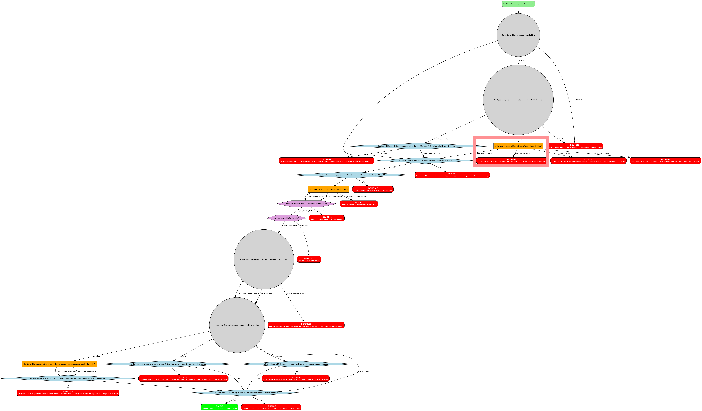{width=70%}
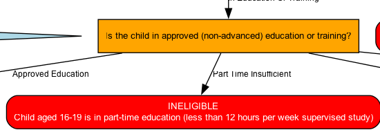{width=400%}
:::

::::

# How we went about answering them: Question 4

> How do we best simulate a user conversation in an authentic way that controls for systematic errors relating to its artificial nature?

- After obtaining initial results, we examined some of the transcripts and other outputs of the failing runs to classify failure causes, observing:
    1. Actor hallucination (observed in `INDETERMINATE` ground-truth only): Where the actor agent goes "off-script" and reports information not contained within the scenario it was given
    2. Elicitation failure: Where the agent under test failed to ask sufficient questions to extract the full situation, including factors which would have made them eligible/ineligible if they were surfaced
    3. Agent-under-test error/hallucination: Where the agent-under-test arrives at the wrong answer without a mitigating external factor
- We can suggest `1.` is purely an artifact of our testing approach, and not anticipated to manifest in the same way with human users.
- Likewise, we can suggest `2.` and `3.` are more intrinsic to the solution under test, and could occur in the real-world
-  We can run a comparative study without the actor agent, where the scenario is given to the agent-under-test directly
    - Whilst this mitigates the effect of `1.` it also mitigates the effect of `2.` which we would wish to study further

# Methodology: Four approaches

- Two modes of exposing scenario to agent-under-test:
  1. "Actor" - another agent was provided with the test scenario, and told to converse with the agent-under-test, pretending to be a human in the situation described by the scenario
  2. "Facts bundle" - Scenario was provided to the agent-under-test directly

- Two modes of eligibility rules representation:
  1. "Free text" - rules in a human-readable format taken from gov.uk website
  2. "Structured" - converting rules into a graphical format, exposed to the agent via MCP tools

# Methodology: Four approaches

|                  | Actor                            | Facts Bundle                           |
|------------------|----------------------------------|----------------------------------------|
| Free Text        | **Free Text with Actor**         | **Free Text with Facts Bundle**        |
| Structured Rules | **Structured Rules with Actor**  | **Structured Rules with Facts Bundle** |

: Combining these we get four approaches

- Our final results all used:
    - the same cohort of 199 scenarios (100 which fell inside the rules, 99 which did not)
    - the same 3 outcomes for eligibility on a per-child basis (`ELIGIBLE`, `INELIGIBLE`, `INDETERMINATE`)
    - data from 6 full runs

# Results: Variation in Failure Modes

|                  | Actor                            | Facts Bundle                           |
|------------------|----------------------------------|----------------------------------------|
| Free Text        | 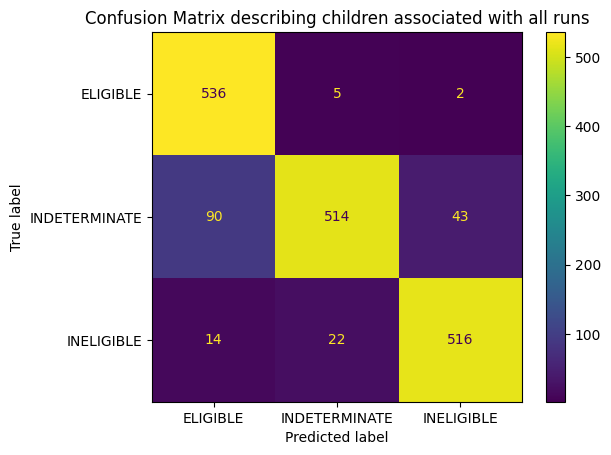{width=100%} Accuracy: 73.52% | {width=80%} Accuracy: 89.89% |
| Structured Rules | 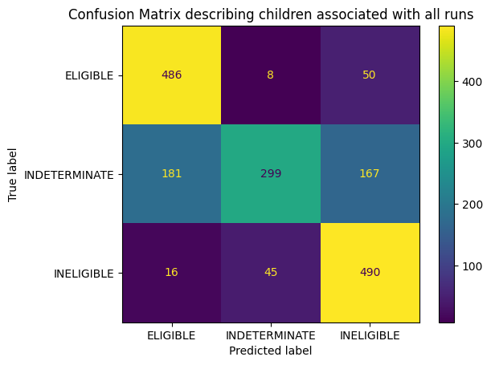{width=100%} Accuracy: 73.19% | 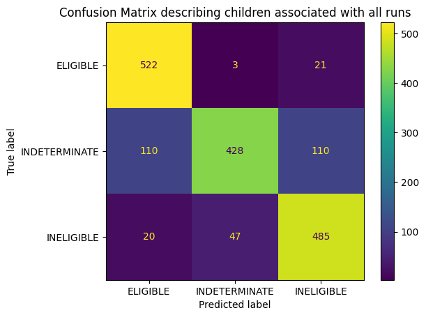{width=80%} Accuracy: 82.18% |

# Analysis: Preferential Failure Modes
:::: {.columns}

::: {.column width="60%"}
- We can classify these failure modes into preferable and non-preferable from a user-outcome perspective:
    - In general, we would prefer to avoid a residual in the `INELIGIBLE` category
        - That would result in someone with at least a possibility of eligibility being discouraged from applying.
    - For this reason, where what should be an `INDETERMINATE` result is misclassified, we would prefer a classification of `ELIGIBLE` rather than `INELIGLBLE`
- Other failure modes impact the utility of the service more than the outcome for the user:
    - They might result in the user wasting time in applying for a benefit that they are not eligible for, but this is a more preferable outcome than discouraging a user from applying for a benefit they are genuinely eligible for.
    - Having a service which reports users which have sufficient information to be `ELIGIBLE` and `INELIGIBLE` users is `INDETERMINATE` is obviously not ideal, but it is not as negative an outcome for the user as other failure modes.
:::

::: {.column width="40%"}
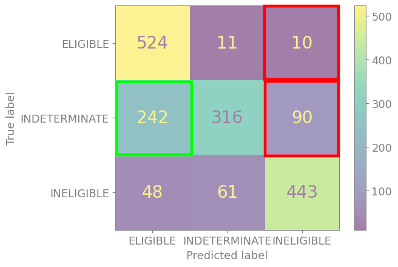
:::

::::

# Methodology: Mixed Effects Model

Bayesian mixed-effects logistic regression (`bambi`):

$$
Y_{ij} \sim \mathrm{Bernoulli}(p_{ij})
$$

$$
\mathrm{logit}(p_{ij}) = \beta_1^\top \text{run\_type}_{ij} + \beta_2^\top \text{rules\_type}_{ij} + u_i
$$

Where:

- $Y_{ij}$ indicates whether run $j$ produced the correct answer for case $i$
- $\text{run\_type}_{ij}$ is a dummy-coded category vector indicating whether the case is presented conversationally or as a facts bundle
- $\text{rules\_type}_{ij}$ is a dummy-coded category vector indicating whether the eligibility rules are provided as free text or in a structured format
- $u_i$ is a case-level random intercept ($u_i \sim \mathcal{N}(0,\sigma_u^2)$)

# Results: Mixed Effects Model - Overall Probability Distributions

:::: {.columns}

::: {.column width="50%"}
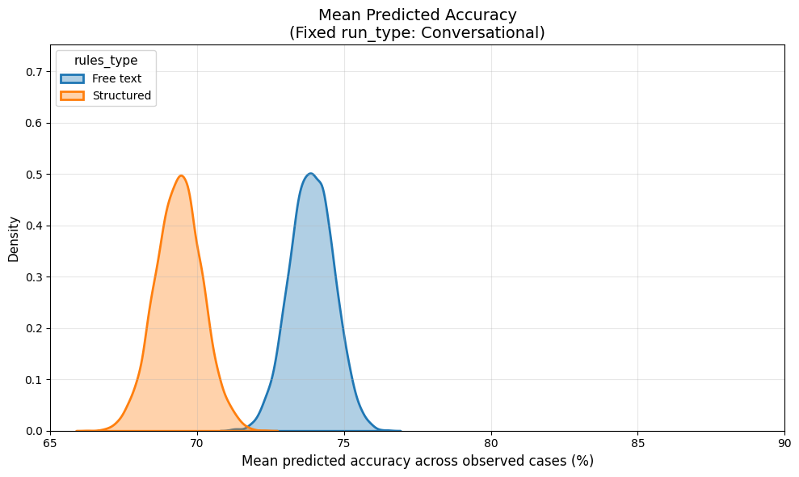
:::

::: {.column width="50%"}
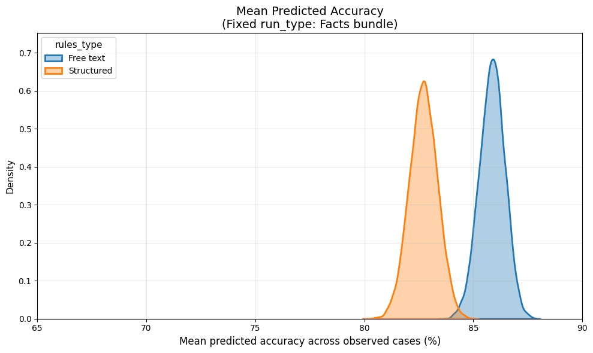
:::

::::

- Clear difference in probability density distributions
    - agent performance when utilising free text rules is better over the entire distribution
    - but the effect is relatively small
      <!-- by inspection there appears to be little overlap -->
<!-- - Offset of Conversational (actor) and Facts Bundle distributions supports the argument that the failure modes arising from conversational interaction are significant -->
<!--     - Standard deviation of conversational run types appear slightly larger by inspection, which suggest the conversational modality has a detrimental effect on consistency -->
<!-- - Structured rule representation shows dropoff in accuracy, not worth the substantial time and effort investment to curate -->

<!-- # Results: Mixed Effects Model - Accuracy-dropoff by Case -->

<!-- :::: {.columns} -->

<!-- ::: {.column width="50%"} -->
<!-- 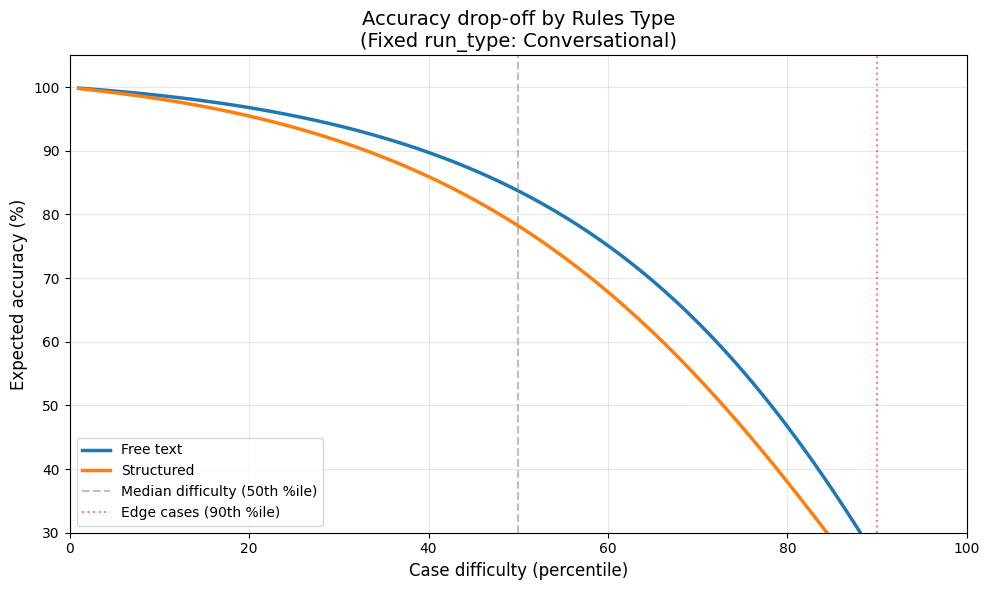 -->
<!-- [> 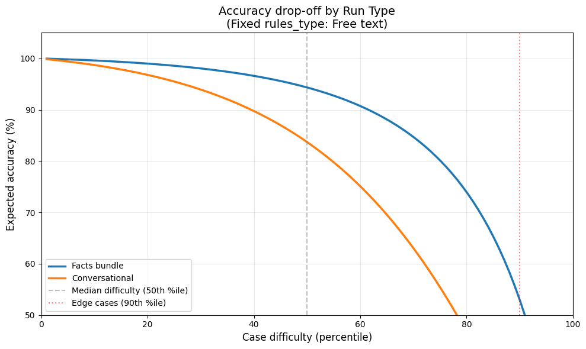 <] -->
<!-- ::: -->

<!-- ::: {.column width="50%"} -->
<!-- 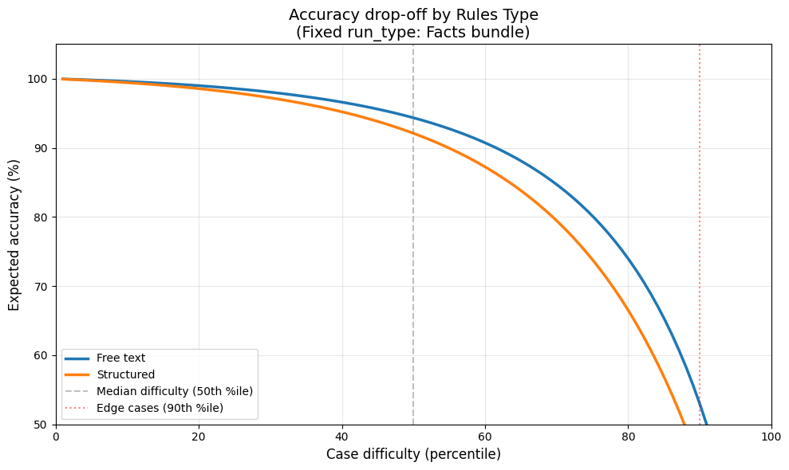 -->
<!-- [> 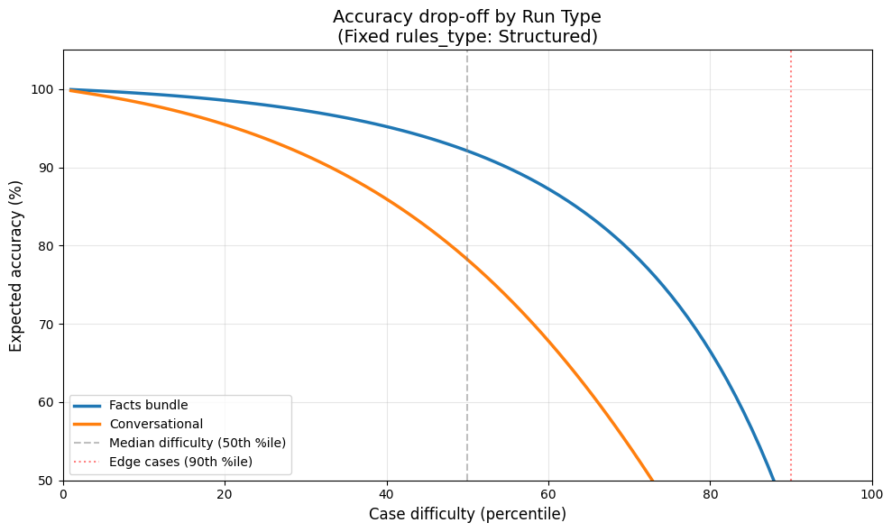 <] -->
<!-- ::: -->

<!-- :::: -->

# Summary: Questions we sought to answer

> 1. How well is an agent able to apply a set of eligibility rules when conversing with a user whose situation is covered by those rules?
    * [There is sufficient potential for the development of a real-world Service]{style="color:red"}
> 2. To what extent is an agent able to report `INDETERMINATE` when presented with a situation not explicitly covered by eligibility rules?
    * [The results suggest that it is able to do this to acceptable accuracy, given the main failure modes are the most acceptable to the business]{style="color:red"}
<!-- TODO go back to initial wording -->
> 3. Given these metrics, what representation of eligibility rules results in the best performance (i.e. accuracy, consistency, token use, latency)?
    * [Overall, basing the rules on the guidance already published gives the best performance from the point of view of all four metrics]{style="color:red"}
4. How do we best simulate a user conversation in an authentic way that controls for systematic errors relating to its artificial nature?
    * [We have answered this to an extent, but further work might be needed for completeness]{style="color:red"}

<!-- TODO add link to repo here -->
<!-- # Appendix: Data synthesis with ground truth -->

<!-- # Appendix: Agentic test harness -->
