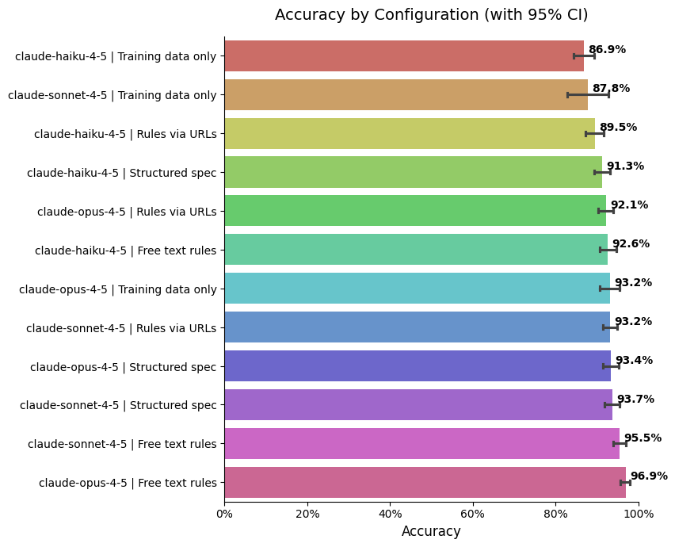
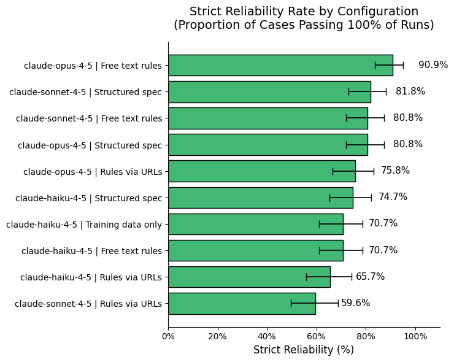
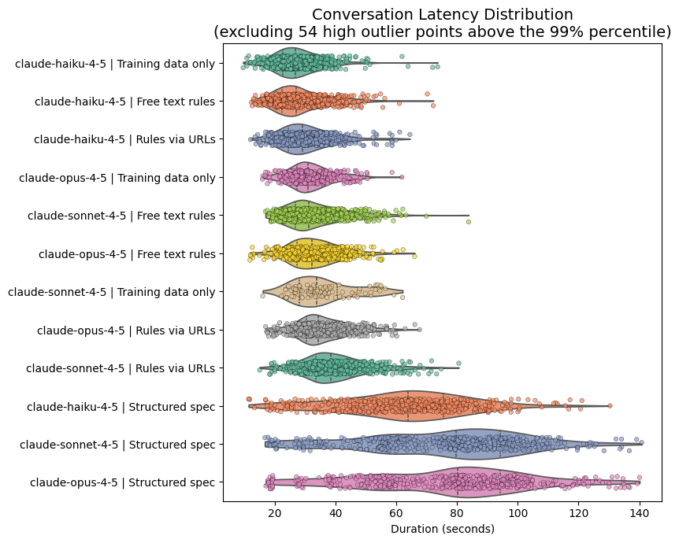
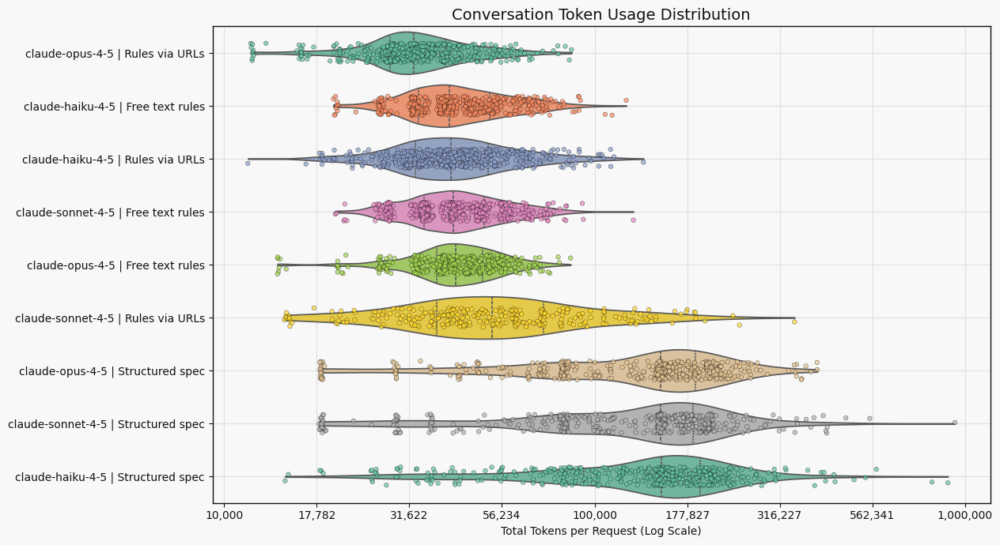
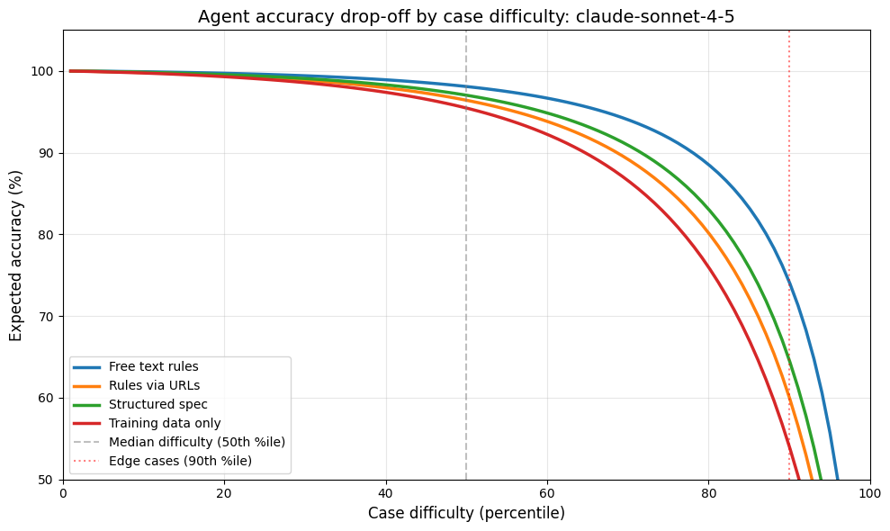
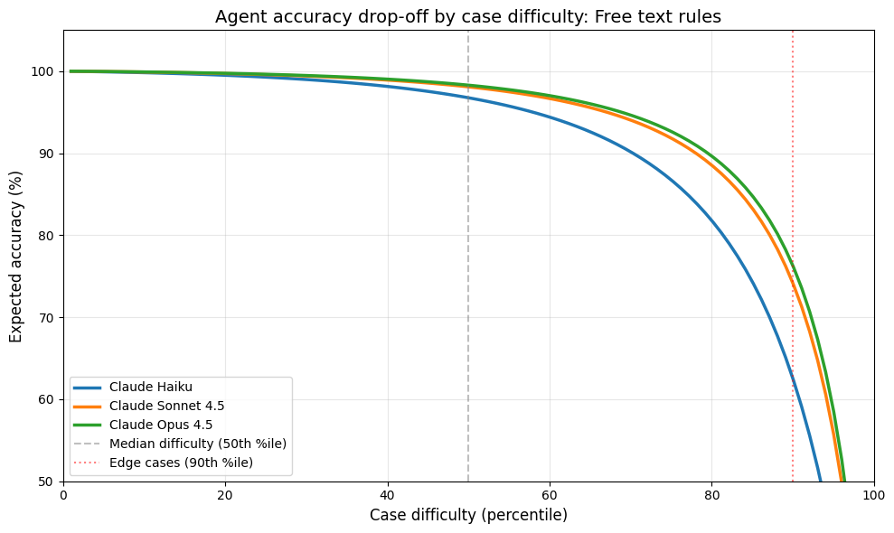

# What this benchmark is for

- Many ways to implement eligibility: we need benchmarks to compare them.
- Eligibility requires rules which need to be owned by departments.
- What are we asking departments to to sign-off?
    - Free text rules similar to GOV.UK guidance
    - Structured decision tree

# How it worked

- Create a ground-truth evaluation set for Child Benefit eligibility.
- Compare models, prompts and rule formats on a dataset where the expected answer is known.

# Core design choice

Only generate cases using facts that are explicitly represented in the rules and the rule engine.

- Example: if the rules say an apprenticeship in **England** stops eligibility, we generate England cases.
- We do **not** generate Wales or Scotland apprenticeship cases in this benchmark.

# Why make that design choice?

- **Ground truth**: We know the expected eligiblity of every test case.
- **Comparing rules implementations**: Clear interpretation of eligibility decision conclusions.

# Limitation

This is **not** a real-world distribution benchmark.

- It excludes circumstances outside the defined rules.
- Accuracy should be interpreted as **relative benchmark accuracy**, not real-world accuracy.
- It does not test knowledge limits.

# Two sources of cases

1. Systematic cases.
2. Random cases.

# 1) Systematic cases

Generated to cover:

- main rule branches
- boundary values
- selected combinations
- multi-child cases

# Systematic case example

```json
{
    "rule": "APPRENTICESHIP",
    "variant": "ENGLAND",
    "expected": [false],
    "children": [{
        "age": 17,
        "started_apprenticeship_in_england": true
    }]
}
```

These are validated by asserting that the rule engine reproduces the expected labels.

# Random case example

A second generator creates additional variation using controlled probabilities:

- claimant lives in UK: `0.80`
- child lives with claimant: `0.66`
- age range: `2..21`
- foster / care / hospital / work probabilities
- discrete upkeep amounts, including the exact Child Benefit threshold

# What the rule engine does

For each child, the generator applies a sequence of explicit rule checks, for example:

- residency
- age / education / extension period
- responsibility / upkeep
- care and hospital rules
- fostering
- work / apprenticeship / benefits

Generates structured and free text output.

# Rule engine internals

A function for each rule:

```python
def check_apprenticeship(child: Dict[str, Any]) -> Tuple[bool, str]:
    """
    Eligibility stops if the child starts an apprenticeship in England.
    """
    if child["started_apprenticeship_in_england"]:
        return False, "Child has started an apprenticeship in England"
    return True, "Child has not started an apprenticeship in England"
```

# What does this produce?

```json
{
  "case_id": "APPRENTICESHIP_FAIL_ENGLAND",
  "facts": {
    "claimant_lives_in_uk": {
      "description": "Whether the claimant lives in the UK.",
      "value": true
    },
    "children": {
      "description": "A list of children the claimant is claiming for.",
      "value": [
        {
          "id": {
            "description": "An identifier for the child.",
            "value": "child_0"
          },
          "name": { "description": "The child's first name.", "value": "Alex" },
          "age": { "description": "The child's age in years.", "value": 17 },
          "lives_with_claimant": {
            "description": "Whether the child lives with the claimant.",
            "value": true
          },
          "in_approved_education": {
            "description": "Whether the child is in approved education or training (e.g. A-levels, GCSEs, NVQ up to level 3). Only relevant for children aged 16-19.",
            "value": false
          },
          "in_extension_period": {
            "description": "Whether the child (aged 16 or 17) has left education and registered with a government-sponsored careers service or the armed forces (qualifying for a 20-week extension).",
            "value": false
          },
          "upkeep_per_week": {
            "description": "The amount in \u00a3 per week the claimant contributes towards the child's upkeep (food, clothes, pocket money, etc.). Only relevant if the child does not live with the claimant.",
            "value": 0.0
          },
          "another_claimant_has_priority": {
            "description": "Whether another person who also lives with the child has priority for claiming Child Benefit.",
            "value": false
          },
          "another_claimant_lives_with_child": {
            "description": "Whether someone who lives with the child is already claiming Child Benefit for them.",
            "value": false
          },
          "care_weeks": {
            "description": "The number of weeks the child has been in local authority care.",
            "value": 0
          },
          "care_home_24h_per_week": {
            "description": "Whether the child spends at least 24 hours per week at home while in local authority care.",
            "value": false
          },
          "hospital_weeks": {
            "description": "The number of weeks the child has been in hospital or residential accommodation.",
            "value": 0
          },
          "claimant_spends_on_child": {
            "description": "Whether the claimant regularly spends money on the child (e.g. food, clothes, books) while the child is in hospital or residential accommodation.",
            "value": false
          },
          "is_fostered": {
            "description": "Whether the child is fostered by the claimant.",
            "value": false
          },
          "council_pays_for_child": {
            "description": "Whether the local council pays towards the child's accommodation or maintenance.",
            "value": false
          },
          "works_24_plus_hours": {
            "description": "Whether the child works 24 or more hours per week in paid employment.",
            "value": false
          },
          "started_apprenticeship_in_england": {
            "description": "Whether the child has started an apprenticeship in England.",
            "value": true
          },
          "receives_qualifying_benefits": {
            "description": "Whether the child receives qualifying benefits in their own right, such as Universal Credit or Employment and Support Allowance.",
            "value": false
          }
        }
      ]
    }
  },
  "agent_script": "=== YOUR SITUATION PROFILE ===\nYou live in the UK.\nYou are inquiring about your 1 child:\n  - Alex is 17 years old and lives with you.\n\nHere are the exact details of your circumstances to use when answering the agent's questions:\n\nRegarding Alex:\n  - Claimant lives in the UK\n  - Child is 17 and not in approved education or extension period\n  - Child lives with claimant\n  - Child is not in local authority care\n  - Child is not in hospital or residential accommodation\n  - Child is not fostered\n  - Child does not work 24+ hours/week\n  - Child has started an apprenticeship in England\n  - Child does not receive qualifying benefits in their own right",
  "expected_eligibility": [
    {
      "child_id": "child_0",
      "name": "Alex",
      "eligible": false,
      "reason": "Child is 17 and not in approved education or extension period; Child has started an apprenticeship in England",
      "circumstances": [
        "Claimant lives in the UK",
        "Child is 17 and not in approved education or extension period",
        "Child lives with claimant",
        "Child is not in local authority care",
        "Child is not in hospital or residential accommodation",
        "Child is not fostered",
        "Child does not work 24+ hours/week",
        "Child has started an apprenticeship in England",
        "Child does not receive qualifying benefits in their own right"
      ]
    }
  ]
}
```

# Example actor agent script

```
You live in the UK.  
You are inquiring about your 1 child:  
  - Alex is 17 years old and lives with you.  
  
Here are the exact details of your circumstances to use when answering the agent's questions:  
  
Regarding Alex:  
  - Claimant lives in the UK  
  - Child is 17 and not in approved education or extension period  
  - Child lives with claimant  
  - Child is not in local authority care  
  - Child is not in hospital or residential accommodation  
  - Child is not fostered  
  - Child does not work 24+ hours/week  
  - Child has started an apprenticeship in England  
  - Child does not receive qualifying benefits in their own right
```

# Results

#



#



#



#

 

# Modelling accuracy {.smaller}

Mixed effects logistic regression (`bambi`):

$$
Y_{ij} \sim \mathrm{Bernoulli}(p_{ij})
$$

$$
\mathrm{logit}(p_{ij}) = \beta_1^\top \text{prompt\_type}_{ij} + \beta_2^\top \text{model}_{ij} + u_i
$$

Where:

- $\text{prompt\_type}_{ij}$  is a dummy-coded category vector (free text, rules in prompt, rules via URLs) 
- $\text{model}_{ij}$ is a dummy-coded category vector (Haiku, Sonnet, Opus)
- $u_i$ is a case-level random intercept ($u_i \sim \mathcal{N}(0,\sigma_u^2)$)

#



#



# Next steps

- Add test cases outside eligibility rules
- Extend beyond Child Benefit
- Extend the evaluation framework beyond binary eligibility
- Separate reasoning failures from elicitation failures
- Analyse failed transcripts for failure reasons
