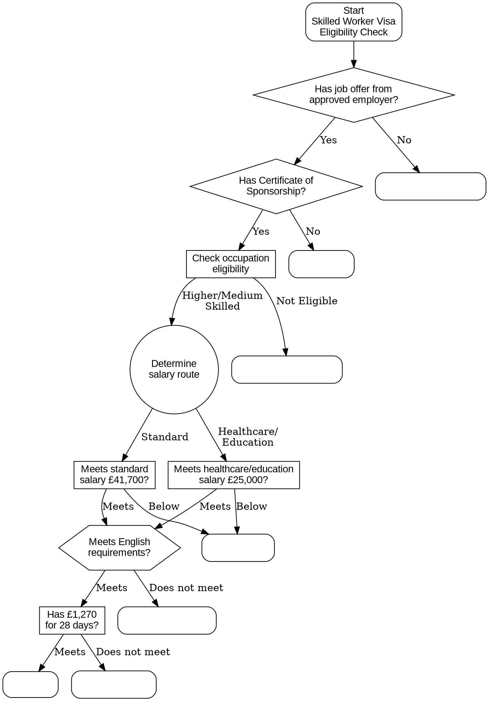
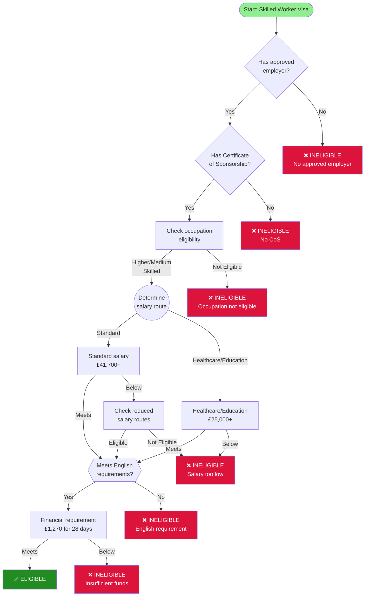

# Visualization Guide

## Overview

This guide explains how to visualize the UK Skilled Worker Visa eligibility decision tree as a graph diagram.

## Graph Structure

### Nodes
Each node in the decision tree can be rendered as a graph node with:
- **ID**: Unique identifier
- **Type**: Visual styling based on node type
- **Label**: The question or description
- **Shape/Color**: Indicates node type

### Edges
Edges connect nodes and represent decision outcomes:
- **Source**: Current node ID
- **Target**: Next node ID (from outcomes)
- **Label**: The condition (e.g., "yes", "no", "meets_requirement")

## Node Type Styling

### Recommended Visual Encoding

| Node Type | Shape | Color | Icon |
|-----------|-------|-------|------|
| `start` | Rounded rectangle | Green | ▶️ |
| `boolean_question` | Diamond | Blue | ❓ |
| `multi_path_check` | Hexagon | Purple | ⑂ |
| `salary_check` | Rectangle | Orange | £ |
| `complex_criteria` | Rectangle | Orange | ⚙️ |
| `financial_check` | Rectangle | Orange | 💰 |
| `occupation_check` | Rectangle | Teal | 💼 |
| `conditional_check` | Diamond | Light Blue | ⚠️ |
| `routing` | Circle | Gray | ↔️ |
| `outcome` (ELIGIBLE) | Rounded rectangle | Green | ✅ |
| `outcome` (INELIGIBLE) | Rounded rectangle | Red | ❌ |

### Label Content

**For question nodes:**
```
[Node Type]
Question text
```

**For outcome nodes:**
```
ELIGIBLE/INELIGIBLE
Reason/description
```

## Layout Recommendations

### Hierarchical Layout (Top to Bottom)
Best for showing the decision flow clearly:
- Start node at top
- Decision nodes in middle layers
- Outcome nodes at bottom
- Group related paths together

### Layered Approach
```
Layer 0: Start
Layer 1: Employer & CoS checks
Layer 2: Occupation eligibility
Layer 3: Salary determination (split by job type)
Layer 4: English language
Layer 5: Financial check
Layer 6: Outcomes
```

## Graphviz Example

Save as `visa_graph.dot`:



Generate image with:
```bash
dot -Tpng visa_graph.dot -o visa_graph.png
dot -Tsvg visa_graph.dot -o visa_graph.svg
```

## Mermaid Example

For markdown/web rendering:



## Interactive Web Visualization

### Using D3.js

```javascript
// Load JSON
fetch('skilled_worker_visa_eligibility.json')
  .then(response => response.json())
  .then(data => {
    // Extract nodes and links
    const nodes = [];
    const links = [];
    
    // Add start node
    nodes.push({
      id: data.decision_tree.root.id,
      type: data.decision_tree.root.type,
      label: data.decision_tree.root.description
    });
    
    // Add edge from start
    links.push({
      source: data.decision_tree.root.id,
      target: data.decision_tree.root.next,
      label: ''
    });
    
    // Process all nodes
    Object.entries(data.decision_tree.nodes).forEach(([id, node]) => {
      nodes.push({
        id: id,
        type: node.type,
        label: node.question || node.description || node.reason
      });
      
      // Add edges based on outcomes
      if (node.outcomes) {
        Object.entries(node.outcomes).forEach(([condition, target]) => {
          links.push({
            source: id,
            target: target,
            label: condition
          });
        });
      }
    });
    
    // Render with D3 force layout
    renderGraph(nodes, links);
  });

function renderGraph(nodes, links) {
  const width = 1200;
  const height = 800;
  
  const svg = d3.select('#graph')
    .append('svg')
    .attr('width', width)
    .attr('height', height);
  
  const simulation = d3.forceSimulation(nodes)
    .force('link', d3.forceLink(links).id(d => d.id))
    .force('charge', d3.forceManyBody().strength(-300))
    .force('center', d3.forceCenter(width / 2, height / 2));
  
  // Draw links
  const link = svg.append('g')
    .selectAll('line')
    .data(links)
    .enter().append('line')
    .attr('stroke', '#999')
    .attr('stroke-width', 2);
  
  // Draw nodes
  const node = svg.append('g')
    .selectAll('circle')
    .data(nodes)
    .enter().append('circle')
    .attr('r', 20)
    .attr('fill', d => getNodeColor(d.type))
    .call(d3.drag()
      .on('start', dragstarted)
      .on('drag', dragged)
      .on('end', dragended));
  
  // Add labels
  const label = svg.append('g')
    .selectAll('text')
    .data(nodes)
    .enter().append('text')
    .text(d => d.id)
    .attr('font-size', 10)
    .attr('dx', 25);
  
  simulation.on('tick', () => {
    link
      .attr('x1', d => d.source.x)
      .attr('y1', d => d.source.y)
      .attr('x2', d => d.target.x)
      .attr('y2', d => d.target.y);
    
    node
      .attr('cx', d => d.x)
      .attr('cy', d => d.y);
    
    label
      .attr('x', d => d.x)
      .attr('y', d => d.y);
  });
  
  function getNodeColor(type) {
    const colors = {
      'start': '#90EE90',
      'boolean_question': '#87CEEB',
      'multi_path_check': '#DDA0DD',
      'salary_check': '#FFA500',
      'outcome': '#228B22'
    };
    return colors[type] || '#CCCCCC';
  }
}
```

### Using Cytoscape.js

```javascript
// Load and render with Cytoscape
fetch('skilled_worker_visa_eligibility.json')
  .then(response => response.json())
  .then(data => {
    const elements = convertToElements(data);
    
    const cy = cytoscape({
      container: document.getElementById('cy'),
      elements: elements,
      style: [
        {
          selector: 'node',
          style: {
            'label': 'data(label)',
            'text-wrap': 'wrap',
            'text-max-width': 80,
            'background-color': 'data(color)',
            'width': 60,
            'height': 60
          }
        },
        {
          selector: 'edge',
          style: {
            'label': 'data(label)',
            'curve-style': 'bezier',
            'target-arrow-shape': 'triangle',
            'line-color': '#999',
            'target-arrow-color': '#999'
          }
        },
        {
          selector: '.outcome-eligible',
          style: {
            'background-color': '#228B22',
            'color': '#fff'
          }
        },
        {
          selector: '.outcome-ineligible',
          style: {
            'background-color': '#DC143C',
            'color': '#fff'
          }
        }
      ],
      layout: {
        name: 'dagre',
        rankDir: 'TB',
        nodeSep: 50,
        rankSep: 100
      }
    });
  });
```

## Simplification Strategies

For presentations or overview diagrams, you can simplify by:

### 1. Collapse Reduced Salary Paths
Group all 5 reduced salary routes into one "Alternative salary routes" node

### 2. Collapse English Language Paths
Show "Meets English requirement" as single node instead of 7 paths

### 3. Remove Routing Nodes
Skip intermediate routing nodes and go directly to decision points

### 4. Summary View
Show only the major stages:
```
Start → Employer/CoS → Occupation → Salary → English → Funds → Outcome
```

### 5. Focus Views
Create separate detailed diagrams for:
- Salary determination logic only
- English language paths only
- Each reduced salary route

## Export Formats

### For Documentation
- **PNG**: High resolution for reports
- **SVG**: Scalable for web/presentations
- **PDF**: For printing

### For Interactive Use
- **HTML + JavaScript**: Interactive explorer
- **JSON**: For programmatic processing
- **GraphML**: For analysis tools

## Tools & Libraries

### Diagramming
- **Graphviz** - Command-line graph visualization
- **Mermaid** - Markdown-based diagrams
- **PlantUML** - UML and flowcharts

### Interactive
- **D3.js** - Custom web visualizations
- **Cytoscape.js** - Network/graph visualization
- **vis.js** - Network diagrams
- **React Flow** - Interactive node-based UI

### Analysis
- **NetworkX** (Python) - Graph analysis
- **igraph** (R/Python) - Network analysis
- **Gephi** - Interactive visualization platform

## Accessibility Considerations

- Use high contrast colors (WCAG AA compliant)
- Add text descriptions for each path
- Provide alternative text formats
- Include path descriptions for screen readers
- Support keyboard navigation in interactive versions

## Next Steps

1. Generate initial diagram using Graphviz or Mermaid
2. Review with subject matter experts
3. Refine layout and styling
4. Create interactive version if needed
5. Generate multiple views (summary, detailed, focus areas)
6. Document any simplifications made
