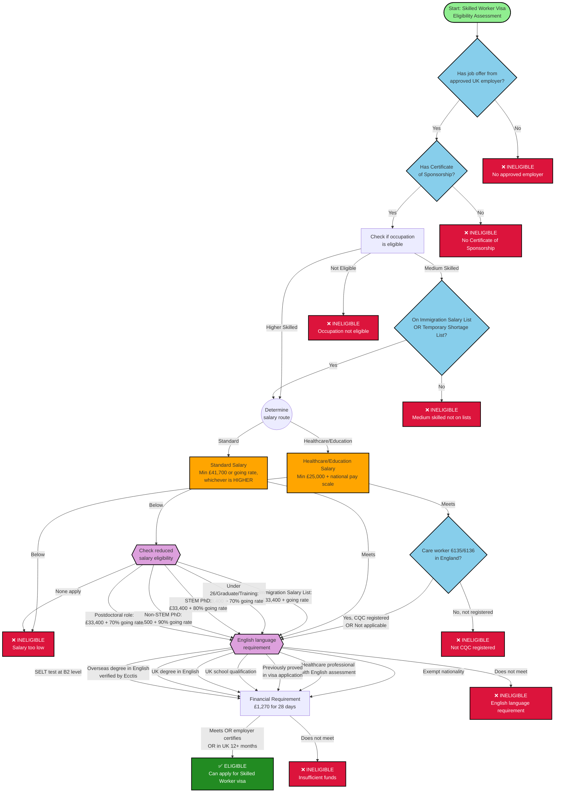

# UK Skilled Worker Visa Eligibility - Simplified Flow



## Summary of Eligibility Criteria

### 1. Mandatory Requirements (All Must Be Met)
- ✓ Job offer from Home Office approved employer
- ✓ Certificate of Sponsorship from employer
- ✓ Eligible occupation (on approved list)
- ✓ Sufficient salary (various routes available)
- ✓ English language proficiency (B2 CEFR or exempt)
- ✓ Financial requirement (£1,270 for 28 days or exempt)

### 2. Salary Routes (One Must Be Met)

#### Standard Route
- £41,700 per year OR going rate for job, whichever is **HIGHER**

#### Healthcare/Education Route
- £25,000 per year AND national pay scale going rate
- Special: Care workers in England must have CQC-registered employer

#### Reduced Salary Routes (at least £33,400 unless stated)
1. **Immigration Salary List**: £33,400 + going rate
2. **Under 26/Graduate/Training**: £33,400 + 70% going rate (max 4 years)
3. **STEM PhD**: £33,400 + 80% going rate
4. **Non-STEM PhD**: £37,500 + 90% going rate
5. **Postdoctoral**: £33,400 + 70% going rate (specific codes only, max 4 years)

### 3. English Language (One Must Be Met)
1. National of exempt country (USA, Canada, Australia, etc.)
2. Healthcare professional with English assessment
3. Previously proved in UK visa application
4. UK school qualification (GCSE, A Level, etc.)
5. UK degree taught in English
6. Overseas degree taught in English (Ecctis verified)
7. SELT test at B2 CEFR level

### 4. Financial Requirement
- £1,270 held for 28 consecutive days, within 31 days of application
- **OR** exempt if: in UK 12+ months with valid visa, or employer certifies maintenance

## Key Decision Points

### Occupation Classification
- **Higher skilled**: Can apply directly
- **Medium skilled**: Must be on Immigration Salary List OR Temporary Shortage List
- **Not eligible**: Cannot apply for Skilled Worker visa

### Salary Comparison Logic
```
Required Salary = MAX(
    Threshold (£41,700 or reduced),
    Going Rate for occupation,
    Percentage of Going Rate (if using reduced route)
)
```

### Time Limits
- Graduate/Under 26/Postdoc reduced routes: **Maximum 4 years total** (including Graduate visa time)
- Standard/other routes: Can extend indefinitely as long as requirements met
- Settlement eligibility: After 5 years continuous residence

## External Data Sources

These lists are maintained by UK Government and change periodically:

- [Eligible occupations](https://www.gov.uk/government/publications/skilled-worker-visa-eligible-occupations)
- [Going rates by occupation](https://www.gov.uk/government/publications/skilled-worker-visa-going-rates-for-eligible-occupations)
- [Immigration Salary List](https://www.gov.uk/government/publications/skilled-worker-visa-immigration-salary-list)
- [Temporary Shortage List](https://www.gov.uk/government/publications/skilled-worker-visa-temporary-shortage-list)
- [Approved employers register](https://www.gov.uk/government/publications/register-of-licensed-sponsors-workers)
